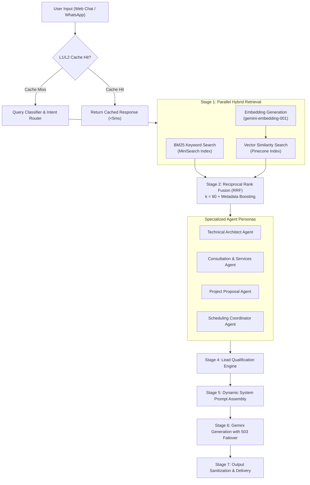

# 🧠 AI Architecture: Hybrid RAG & Multi-Agent Orchestration

## 1. Architectural Overview

The portfolio features an intelligent, multi-agent Retrieval-Augmented Generation (RAG) system capable of answering technical architecture inquiries, evaluating client project proposals, qualifying business leads, and demonstrating deep full-stack engineering expertise.

---

## 2. Hybrid Retrieval Pipeline (Pinecone + MiniSearch)

Rather than relying purely on vector embeddings (which can miss exact keyword matches like technical library names or specific dates), the system combines semantic vectors with lexical keyword indices:

### A. Stage 1: Dual Asynchronous Fetch
- **Lexical Search (BM25)**: Executed against a local, memory-mapped **MiniSearch** index containing project summaries, resume details, and technical case studies.
- **Semantic Vector Search**: Generates 768-dimensional embeddings using `gemini-embedding-001`, queried against a **Pinecone** serverless vector index with cosine similarity.

### B. Stage 2: Reciprocal Rank Fusion (RRF)
Results from both retrieval engines are merged using the RRF algorithm with constant $k = 60$:

$$\text{RRF Score}(d) = \frac{1}{k + \text{Rank}_{\text{Pinecone}}(d)} + \frac{1}{k + \text{Rank}_{\text{BM25}}(d)}$$

### C. Stage 3: Dynamic Metadata Boosting
Retrieval scores are further weighted based on classified user intent:
- **Project queries**: Prioritizes chunks tagged with `type: "project"`.
- **Skill queries**: Boosts chunks categorized under `section: "skills"`.
- **Architecture queries**: Multiplies weights for chunks tagged with distributed systems, RAG, and cloud infrastructure metadata.

---

## 3. Multi-Agent Dispatcher Engine

Incoming queries are classified into five specialized agent personas:

| Agent Persona | Focus | Directive |
|---|---|---|
| **Technical Architect** | System design, RAG, full-stack tech stack | Explains architectural patterns, database schemas, latency optimizations, and trade-offs. |
| **Sales & Services** | Project inquiries, freelance development, rates | Outlines engagement tiers, capabilities, timeline estimations, and value delivery. |
| **Proposal Specialist** | Structured deliverables, statement of work | Formulates milestone breakdowns, implementation phases, and tech stack proposals. |
| **Scheduling Coordinator** | Meetings, 1-on-1 calls, calendar alignment | Guides the user to book a consultation or leave contact details for direct follow-up. |
| **General / Portfolio** | Experience, background, education | Summarizes career trajectory, past roles, publications, and open-source contributions. |

---

## 4. Automated Lead Qualification Engine

For every incoming consultation or business inquiry, the system parses the conversation stream to extract structured commercial intent:
- **Budget Tier**: Detects ranges (<$5k, $5k–$15k, $15k–$30k, $30k+ enterprise).
- **Timeline**: Identifies urgency (Urgent <2 weeks, 1 month, 2–3 months, flexible).
- **Project Type**: Classifies project scope (Enterprise RAG, Multi-Agent System, Full-Stack SaaS, Code Audit).
- **Calculated Lead Score**: Automatically scores leads into **High**, **Medium**, or **Low** priority to tailor AI responsiveness and follow-up directives.

---

## 5. Model Failover & Resilience

To maintain 99.9% availability during peak API traffic:
- **Primary Model**: `gemini-3.5-flash-lite` for ultra-low latency response generation.
- **Automatic 503 Service Unavailable Failover**: The API wrapper transparently catches HTTP 503 or transient rate-limit responses and retries the generation with `gemini-3.1-flash-lite`.
- **Caching**: Multi-tier LRU cache stores common query embeddings and RAG retrieval maps to minimize latency and API cost.
