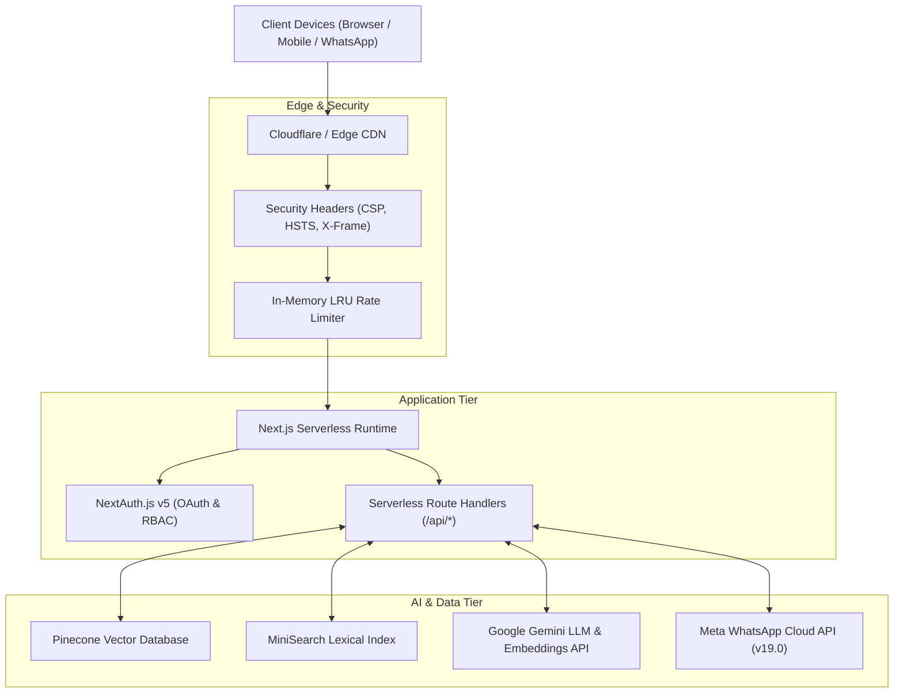

# 🏛️ System Architecture & DevSecOps Blueprint

## 1. High-Level Architecture Overview

The portfolio is architected as an enterprise-grade, high-performance web platform combining modern full-stack development with state-of-the-art Generative AI capabilities.



---

## 2. Directory & Module Structure

```
portfolio-ai/
├── documents/                     # Architecture & Engineering Specifications
│   ├── whatsapp-integration.md    # WhatsApp Cloud API & Multi-Agent Architecture
│   ├── ai-rag-orchestration.md    # Hybrid RAG, Pinecone, MiniSearch & Gemini Pipeline
│   └── system-architecture.md     # System Topology & DevSecOps Hardening
├── src/
│   ├── app/                       # Next.js App Router (Pages & API Handlers)
│   │   ├── api/webhooks/whatsapp/ # WhatsApp Ingress Webhook (GET/POST)
│   │   ├── api/chat/              # Interactive Web RAG Chatbot API
│   │   └── api/embed/             # Admin Ingestion & Embedding Pipeline
│   ├── components/                # React UI Components (Tailwind CSS v4 + Framer Motion)
│   │   ├── ui/whatsapp-widget.tsx # WhatsApp AI Float Widget
│   │   └── sections/              # Hero, Experience, Projects, Services, Contact
│   └── lib/                       # Core Services & Business Logic
│       ├── agents/                # WhatsApp Service, Dispatcher, Lead Qualifier
│       ├── orchestrator/          # Hybrid RAG (Pinecone + MiniSearch RRF Engine)
│       ├── gemini.ts              # Google GenAI Client with 503 Auto-Failover
│       ├── pinecone.ts            # Pinecone Vector DB Connection & Metadata Types
│       └── security.ts            # Prompt Injection Filtering & Output Sanitization
├── next.config.ts                 # Next.js Security Headers & Build-Time Env Mapping
└── package.json                   # Dependencies & Scripts
```

---

## 3. DevSecOps Hardening & Threat Mitigations

The system incorporates defense-in-depth mitigations covering the OWASP Top 10:

### A. Prompt Injection Defense
- **Filter Engine**: User inputs are stripped of system prompt overrides, delimiter manipulation phrases, and instruction hijacks before vector search or LLM generation.
- **Length Bounds**: Input strings are truncated at 2,000 characters to prevent token flood attacks.

### B. Output Sanitization & XSS Defense
- **Markdown Sanitization**: All AI-rendered responses are filtered through `rehype-sanitize` to strip executable HTML scripts, event handlers (`onload`, `onerror`), and untrusted iframes.

### C. Rate Limiting & Resource Exhaustion Protection
- High-performance, in-memory sliding window rate limiters (powered by bounded LRU caches) enforce per-IP rate limits across both web chat and WhatsApp webhook endpoints to prevent budget drain and denial-of-service.

### D. Production HTTP Security Headers
Configured in `next.config.ts`:
- **Content-Security-Policy (CSP)**: Restricts script, style, image, and connection origins to trusted CDNs and APIs.
- **Strict-Transport-Security (HSTS)**: Forces modern browsers to communicate strictly over encrypted HTTPS (`max-age=31536000`).
- **X-Frame-Options (`SAMEORIGIN`)**: Mitigates clickjacking attacks.
- **X-Content-Type-Options (`nosniff`)**: Prevents MIME-type confusion vulnerabilities.
