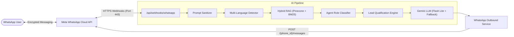

# 📱 WhatsApp Cloud API Integration: Architecture & Engineering Guide

## 1. Executive Summary
The WhatsApp AI Integration allows prospective clients, recruiters, and collaborators to interact directly with an automated AI Systems Assistant via WhatsApp. The architecture operates over Meta's WhatsApp Cloud API (Graph API v19.0), utilizing serverless event-driven webhooks, hybrid retrieval-augmented generation (RAG), and multi-agent persona orchestration.



---

## 2. Ingress & Webhook Lifecycle

The integration exposes a single route handler: `/api/webhooks/whatsapp`.

### A. Handshake Verification (`GET`)
When registering the callback URL in the Meta Developer Portal, Meta sends an HTTP `GET` request:
- **`hub.mode`**: Must equal `"subscribe"`.
- **`hub.verify_token`**: Must strictly match the server secret `WHATSAPP_VERIFY_TOKEN`.
- **`hub.challenge`**: Arbitrary verification string echoed back with HTTP 200 to confirm server ownership.

### B. Event Notification (`POST`)
When a user sends a message, Meta issues an HTTP `POST` containing a structured JSON payload:
- Extracts `entry[0].changes[0].value.messages[0]`.
- Identifies message type (`text`, `interactive`, `button`, or `media`).
- Resolves sender's phone number (`message.from`) and the receiving phone number ID (`metadata.phone_number_id`).
- Processes the message through the AI pipeline and dispatches the reply **before** resolving the HTTP 200 response to prevent serverless execution freezing.

---

## 3. Seven-Stage AI Processing Pipeline

When an incoming message is received, it executes through seven discrete architectural layers:

```
[1. Sanitize Input] ──> [2. Detect Language] ──> [3. Hybrid RAG Search]
                                                           │
[6. Gemini LLM] <── [5. Lead Qualification] <── [4. Multi-Agent Dispatch]
       │
       ▼
[7. WhatsApp Reply Delivery]
```

1. **Input Sanitization**: Strips prompt injection attempts, control characters, and enforces character bounds.
2. **Language Detection**: Identifies 7+ languages (English, Hindi, Spanish, French, German, Japanese, Arabic) and generates dynamic linguistic instructions so the AI replies fluently in the client's language.
3. **Hybrid RAG Retrieval**: Runs parallel vector search against Pinecone and keyword search via MiniSearch, fused with Reciprocal Rank Fusion (RRF) and metadata boosting.
4. **Multi-Agent Dispatcher**: Dynamically routes to specialized personas (Technical Architect, Sales / Services, Scheduling, Proposal, Support).
5. **Lead Qualification Engine**: Analyzes client intent, timeline, budget tier, and stack requirements, computing a Lead Priority Score (High / Medium / Low).
6. **Gemini LLM Generation**: Uses low-latency models with automatic failover to fallback models on service unavailability (HTTP 503).
7. **Outbound Dispatch**: Sends structured, WhatsApp-formatted Markdown (`*bold*`, bullets) via Meta Graph API.

---

## 4. Configuration & Credentials

The integration requires the following environment variables:

| Variable | Scope | Purpose |
|---|---|---|
| `WHATSAPP_TOKEN` | Server Private | Permanent System User Bearer token for Graph API requests |
| `WHATSAPP_PHONE_ID` | Server Private | Meta Phone Number Object ID for the sending number |
| `WHATSAPP_VERIFY_TOKEN` | Server Private | Custom secret string used during the GET verification handshake |
| `WHATSAPP_NUMBER` | Public / Server | Display phone number (E.164 format) for client click-to-chat links |

---

## 5. Network, DNS & Firewall Specifications

- **Protocol**: HTTPS over standard port **443** with a valid Certificate Authority (CA) TLS certificate.
- **FQDN**: Fully Qualified Domain Name required (bare IP addresses are rejected by Meta).
- **Meta Network CIDR Blocks (AS32934)**:
  `31.13.24.0/21`, `31.13.64.0/18`, `45.64.40.0/22`, `66.220.144.0/20`, `69.63.176.0/20`, `69.171.224.0/19`, `74.119.76.0/22`, `103.4.96.0/22`, `129.134.0.0/16`, `157.240.0.0/16`, `173.252.64.0/18`, `179.60.192.0/22`, `185.60.216.0/22`, `204.15.20.0/22`.
- **Payload Verification**: Inbound requests can be authenticated using `X-Hub-Signature-256` HMAC-SHA256 verification against the Meta App Secret.

---

## 6. Enterprise Setup Procedures

1. **Meta App**: Provisioned under the **Business** category with the **WhatsApp** product attached.
2. **Permanent System User Token**:
   - Created in Meta Business Manager under **System Users** with **Admin** role.
   - Assigned **Full Control** on both the **Developer App** and **WhatsApp Business Account (WABA)**.
   - Issued with scopes: `whatsapp_business_messaging` and `whatsapp_business_management`.
3. **WABA Event Subscription**:
   - Bound via `POST https://graph.facebook.com/v19.0/{WABA_ID}/subscribed_apps`.
   - The `messages` event trigger is toggled ON under Webhook configuration.
